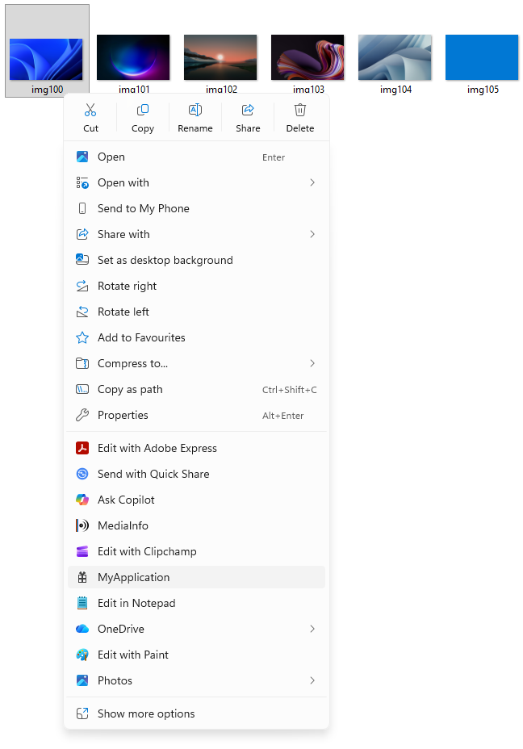
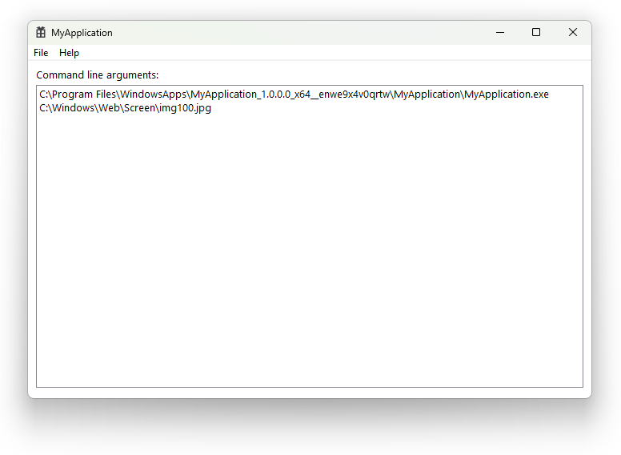
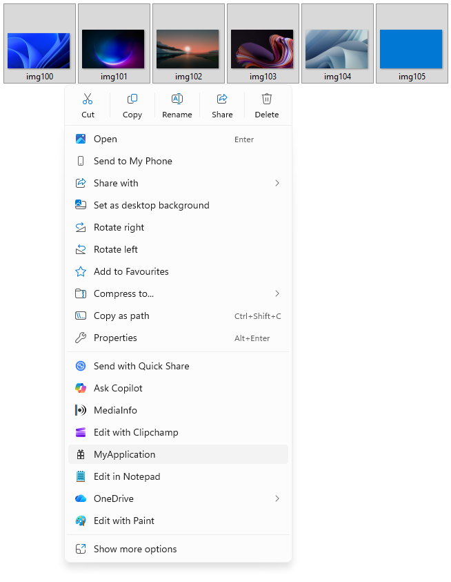
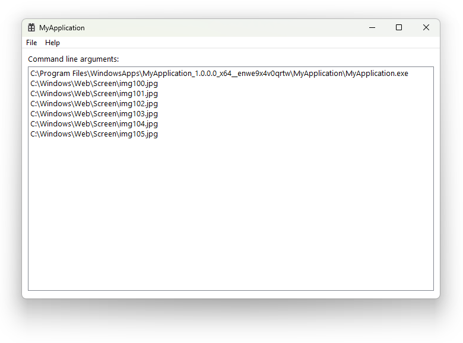
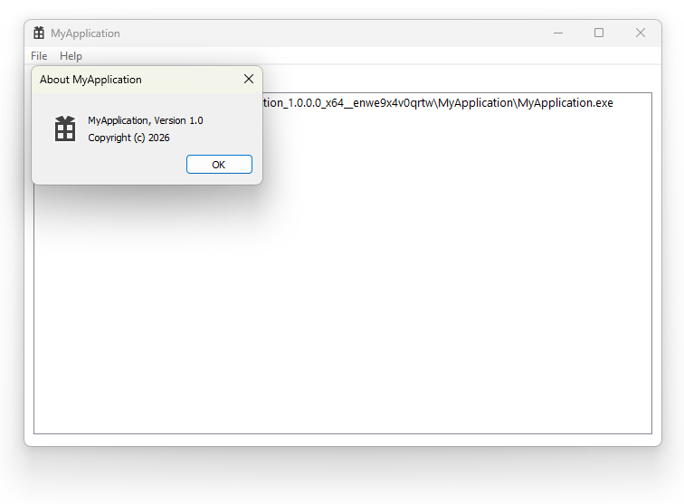

# Demo

This directory contains a demo application named MyApplication and a packaging project to demonstrate the usage of the IExplorerCommand shell extension in a packaged MSIX application.

Upon installation, a context menu entry for MyApplication will appear in Windows File Explorer's context menu when right-clicking any file or folder. Multiple files and folders can also be selected. Clicking on the context menu entry will launch MyApplication and pass the selected files and folders as command line arguments to it. MyApplication is a demo application that simply displays a list of all the command line arguments passed to it.

## Pre-built package

Pre-built MSIX packages of this demo for various CPU architectures are automatically built by GitHub Actions and can be found on the [releases page](https://github.com/cjee21/IExplorerCommand-Examples/releases).

Since the packages are unsigned, they can only be installed on Windows 11 using the following command in an elevated PowerShell for testing purposes.

```powershell
Add-AppxPackage -Path MyApplication.msix -AllowUnsigned
```

## Screenshots










